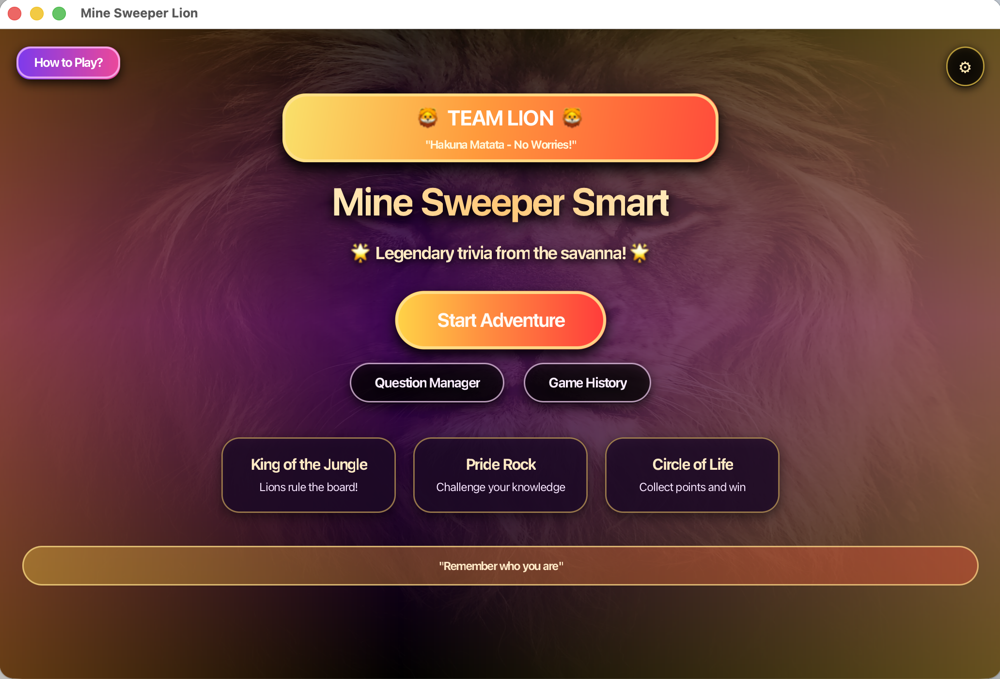
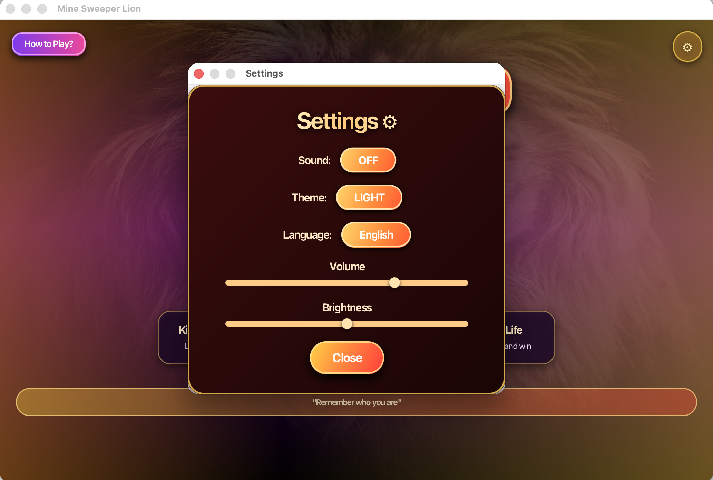
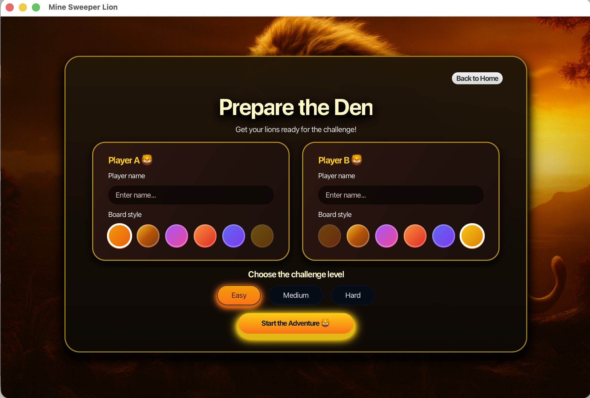
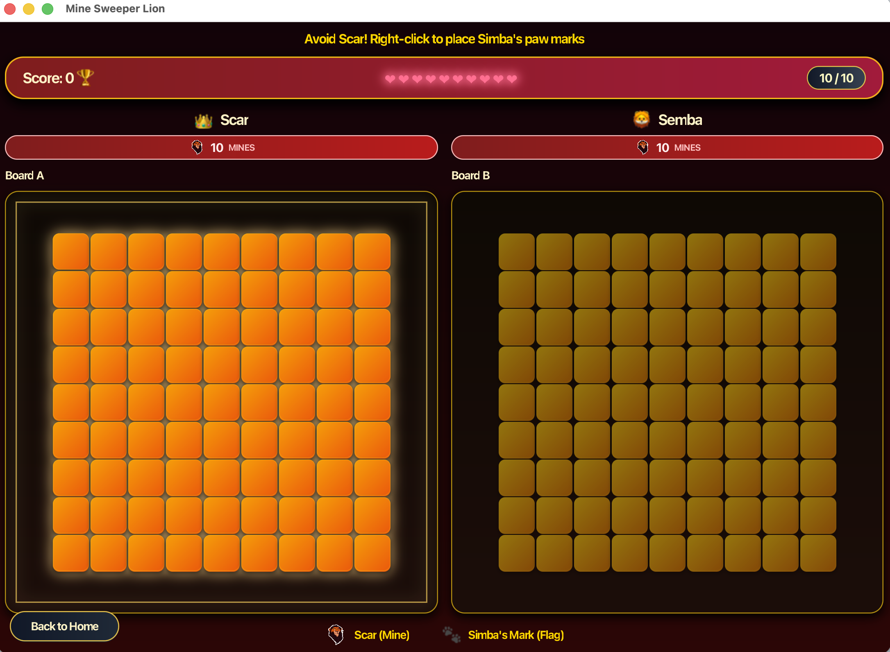
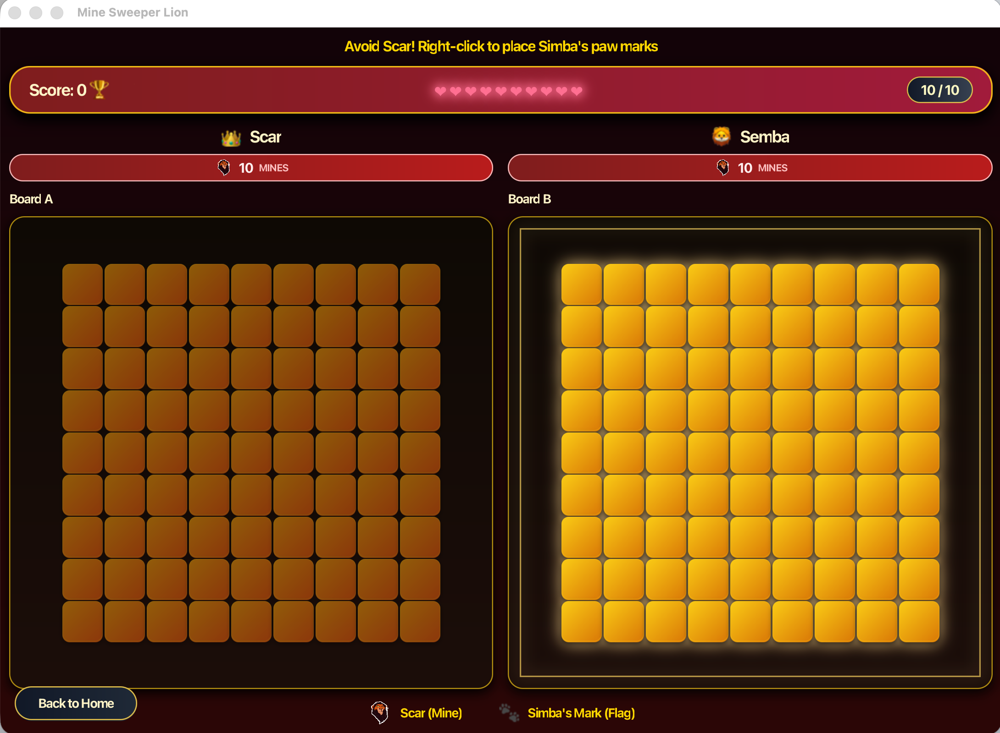
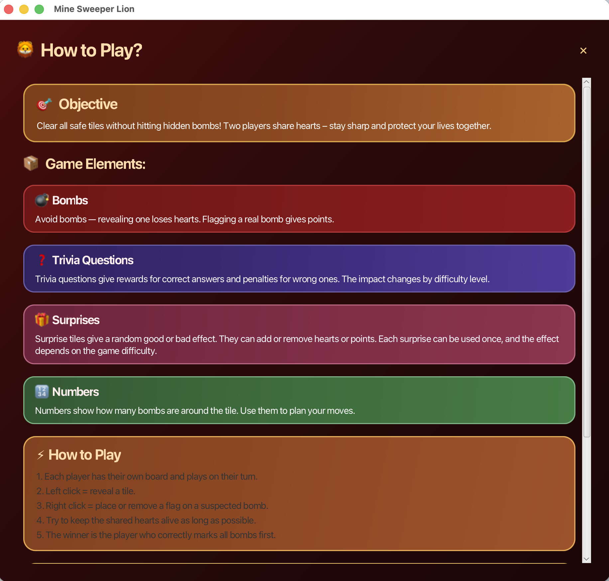
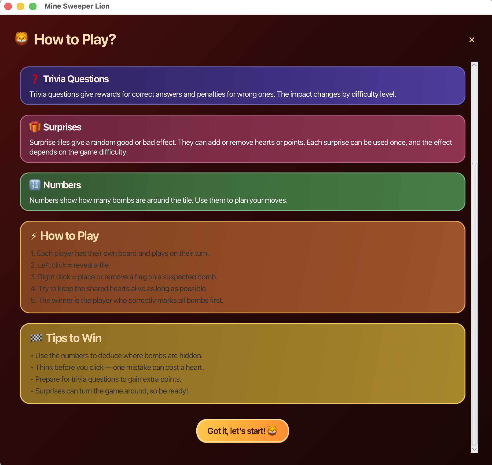
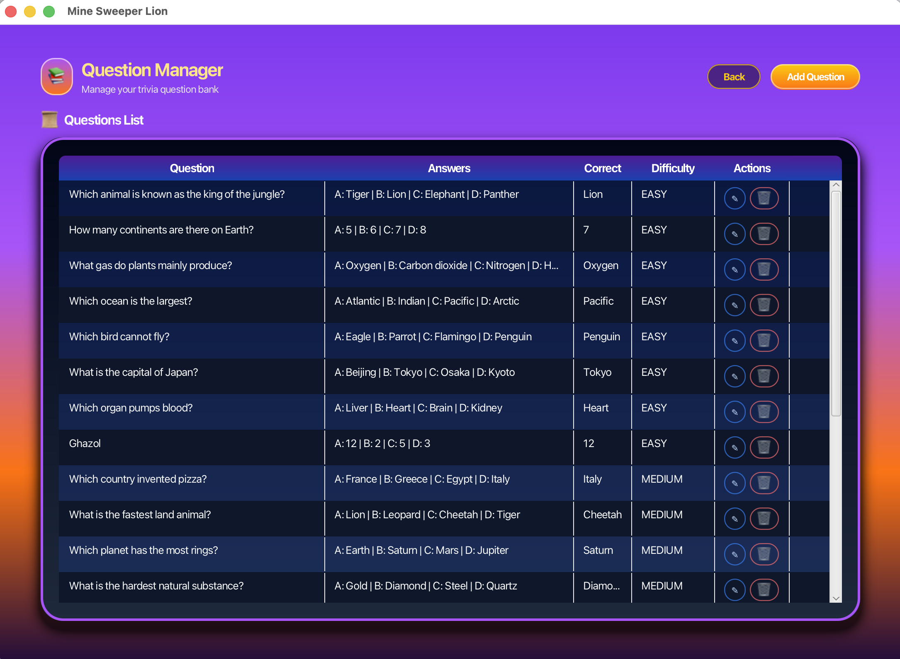
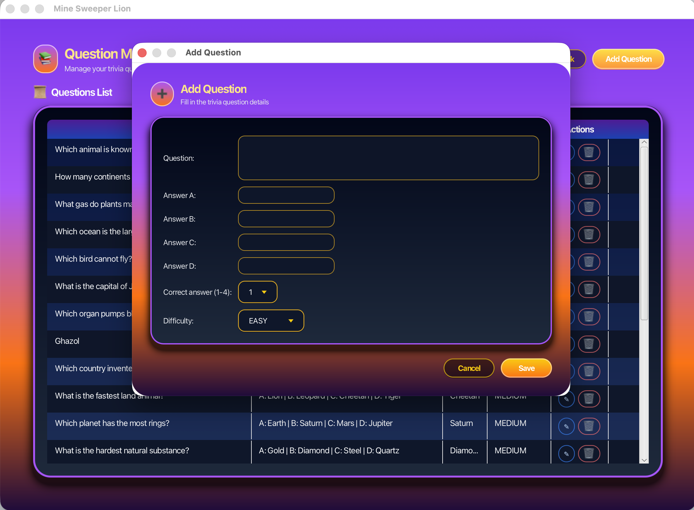
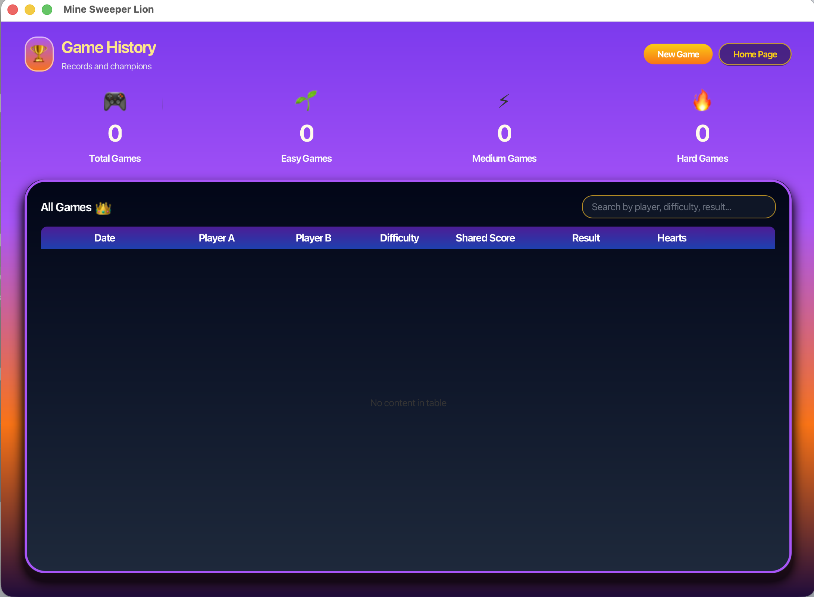

  🦁🔥🌅 
  <strong style="font-size:26px;">Mine Sweeper Lion</strong> 
  <em>Circle of Life • Pride • Destiny</em>

---
# 🦁 Mine Sweeper Lion
*When the first light touches the savanna…  
and the wind carries the memory of kings…  
a new story begins.*

---

## 🌅 Prologue — The Dawn of the Pride Lands
Before the game.  
Before the boards.  
Before choices were made.

There was only **the savanna** — ancient, golden, breathing with the rhythm of the **Circle of Life**.

From these lands of courage and destiny,  
a new challenge rises…  
whispered by the wind, watched by the stars,  
and carried by the proud roar of lions.

**This is not just a game.  
It is a journey.  
A trial.  
A legacy.**

Welcome…  
to **Mine Sweeper Lion**.

---

## 🏠 Act I — The Call to Adventure
As the sun rises over Pride Rock,  
a golden glow reveals the **Home Screen**,  
standing tall like a beacon for all lions who dare to play.

Here, every path begins.  
Here, every memory is stored.  
Here, destiny calls.

---

## ⚙️ Act II — The Circle of Choice
Before stepping into the trials of the land,  
every lion must prepare their senses.

Within the quiet sanctuary of **Settings**,  
the world bends to your will:

- Quiet the winds
- Soften or brighten the glow of the savanna
- Shift the land between light and shadow
- Choose the language of your roar

---

## 👥 Act III — Rise of the Lions
Two lions stand at the edge of destiny.  
Their names carved in the dust,  
their colors chosen like war paint.

This is where their journey begins — with courage, identity, and the will to rise.

---

## 🎮 Act IV — The Trial of the Twin Boards
The drums of the savanna echo.  
Two boards emerge:  
two paths, two fates, two lions locked in challenge.

Each tile is a heartbeat.  
Each number a whisper of truth.  
Each bomb a shadow of Scar.  
Each flag a mark of Simba’s courage.

Hearts rise and fall like the sun.  
Scores shift like desert winds.  
And only the wise survive.

---

## 🧭 Act V — The Wisdom of Rafiki (How to Play)
Even the bravest lion must first learn the laws of the land.  
Here, knowledge flows like the stories spoken around ancient fires.

---

## 🌾 Act VI — Secrets of the Pride Lands
Every symbol has meaning.  
Every tile hides truth.  
Every surprise holds fate in its palm.

Just as Rafiki taught Simba — wisdom is the lion’s sharpest claw.

---

## ⚔️ Act VII — Path of Victory
To win, a lion must listen:

- Trust the numbers — they never lie
- Think before you strike — one mistake may take a heart
- Trivia sharpens the mind
- Surprises bend destiny
- And the quickest to uncover the truth becomes the rightful victor

May bravery guide your paw.  
May instinct guide your step.  
May destiny guide your roar.

---

## 📝 Act VIII — The Archives of the Pride
Deep in the heart of the lands lies ancient knowledge.  
Questions carved in stone, ready to test any lion’s wisdom.

---

## ➕ Act IX — A New Story Written
Every lion adds their own tale to the savanna.  
Here is where new questions — new lessons — are born.

---

## 📜 Act X — Echoes of Those Who Walked Before
Every roar, every victory, every fall…  
is remembered by the land.

The **Game History** records them all — as echoes carried forever by the wind.

---

## 🎵 Act XI — The Voice of the Savanna
As your paws touch the land,  
the savanna hums its sacred melody.

Inspired by **“Circle of Life”**,  
the music breathes life into every moment,  
guiding each lion toward their fate.

---

## 👑 Final Act — The Makers of the Kingdom
*Those who shaped this world,  
who carved its colors,  
its mechanics,  
its roar:*

- Janadan Sbeihat
- Yasmeen Jamal
- Layan Shawahny
- Dana Naser

Together we built more than a game — we built a tale worthy of the Pride Lands.

---

## 🌄 Epilogue
And so the tale continues…

Two players.  
Two destinies.  
One savanna.

May your courage never falter,  
may your hearts stay unbroken,  
and may every move bring you closer to your rightful place — **on Pride Rock.**
